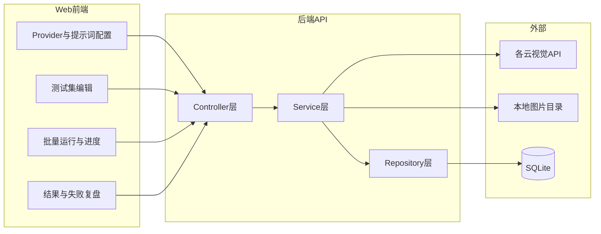

# 图片 Agent 测试平台（网页版）设计方案

## 目标与边界

- **场景**：在浏览器里选 Provider（阿里、火山、OpenAI 等）、模型与自定义参数，配置系统提示词与用户提示词模板，对**测试集合**批量调用视觉模型，按可配置的规则判定对错，统计正确率，并重点查看**失败用例对应的图片与模型原文**。
- **部署范围**（你已选）：**本机/内网**，前后端同机启动；测试图片放在**服务端可读目录**（例如 `./data/images`），前端通过接口预览缩略图/原图 URL，避免把密钥暴露在纯静态页。
- **断言**（你已选）：抽象成**策略**，先落地「简单 + 结构化」，并预留**代码判定**（本地工具可用轻量沙箱 + 超时，避免 `eval` 裸跑）。

## 整体架构

- **前端**：单页应用（建议 **React + Vite + TypeScript**），表格/表单 + JSON 编辑区（模型扩展参数）+ 运行进度（SSE 或轮询）+ 结果列表（筛选失败、侧栏看大图与模型输出）。
- **后端**：**Node.js**（建议 **Fastify**）较适合统一封装多家 HTTP/SDK；目录分层对齐你的规范：**controller / service / repository / model**，另加 `**provider/`（适配器）** 与 `**assert/`（断言引擎）**。
- **持久化**：**SQLite**（单文件、零运维），存：Provider 配置档案、测试集、用例、运行记录、每条结果与断言详情。
- **批量执行**：本机场景用 **进程内任务队列 + 并发上限**（如 p-limit）即可；运行状态写库，前端订阅进度。

## 核心概念（产品向）

| 概念              | 说明                                                                                       |
| --------------- | ---------------------------------------------------------------------------------------- |
| **Provider 档案** | 选厂商 + Base URL（如兼容 OpenAI 的 endpoint）+ API Key（仅存本机服务端环境变量或本地加密文件，不入前端）+ 默认模型与默认 JSON 参数 |
| **提示词模板**       | 系统提示词 + 用户提示词；支持占位符，如 `{{scene}}`、`{{lang}}`；每条用例可覆盖变量                                   |
| **测试集 / 用例**    | 每条用例绑定：`imageRelativePath`（相对配置的根目录）、可选变量表、可选**用例级**断言覆盖                                 |
| **断言规则（可组合）**   | 多条规则 **AND**（必要时后续加 OR 组）；每条规则是一种「策略」                                                    |
| **一次运行（Run）**   | 选定 Provider 档案 + 测试集 + 并发数；产出汇总正确率与明细                                                    |

## Provider 抽象（技术向）

定义统一接口，例如：`chatVision({ model, messages, images, params }) -> { text, raw }`。

- **OpenAI / 兼容 OpenAI 的视觉接口**：一套实现覆盖「官方 OpenAI」与多数「OpenAI 兼容网关」。
- **阿里云、火山引擎**：各写一个 **Adapter**，内部把统一入参映射为对方 SDK 或 REST 的字段（图片用 **base64** 或对方要求的 URL；本机图片由后端读文件转 base64 最省事）。
- **扩展方式**：新增厂商 = 新 Adapter + 在配置里登记 `providerType` 与鉴权字段名。

前端只选 `providerType` 与模型名、编辑「额外参数」JSON；真正请求由后端发出。

## 断言引擎设计（简单 → 复杂 → 代码）

用 **策略模式**，每条策略实现同一接口：`match(actual: string, context) -> { ok, detail }`。

建议首版策略：

1. **contains**：输出包含/不包含子串（可多个关键词）。
2. **regex**：正则匹配（注意超时与 ReDoS，限制 pattern 长度）。
3. **jsonParse + jsonPath**：先 `JSON.parse`，再用 **JSONPath 或轻量路径**（如 `choices[0].label`）取值后与期望值比对（equals / inList / regex）。
4. **customScript（可选，第二阶段）**：后端用 **isolated-vm / vm2**（Node）或 **quickjs** 类沙箱，传入只读对象 `{ outputText, parsedJson?, caseVars }`，脚本返回 `{ pass: boolean, reason?: string }`；强制 **超时（如 200ms）** 与 **禁止 require/fs**。

**组合语义**：默认「全部规则通过才算对」；后续若需要可加「规则组 OR」。

## 数据模型（SQLite 表级草案）

- `provider_profiles`：名称、类型、endpoint、默认模型、默认参数 JSON、密钥引用名（值走环境变量）。
- `prompt_profiles`：系统提示、用户模板、说明。
- `test_suites`：名称、图片根目录（绝对路径或相对项目根）、默认断言 JSON。
- `test_cases`：suite_id、image_path、variables JSON、断言覆盖 JSON（可空）。
- `test_runs`：关联 suite、provider_profile、prompt_profile、状态、汇总统计。
- `test_run_items`：每条用例一条：请求参数快照、模型原文、解析结果、每条断言明细、pass/fail、耗时、错误栈。

## 前端页面信息架构

1. **设置**：Provider 档案列表；模型与参数 JSON；密钥说明（只写 env 名，不存明文到仓库）。
2. **提示词**：系统/用户模板编辑器 + 占位符预览（选一条样例用例试填）。
3. **测试集**：表格编辑用例（图片路径、变量）；支持从文件夹**扫描导入**（后端列目录 API）减少手输路径。
4. **运行**：选三样东西（Provider + 提示词配置 + 测试集），设并发，开始/停止。
5. **报告**：总正确率、按断言类型失败分布（后续）；失败列表可点开：**左图右文**（模型输出 + 哪条断言失败）。

## 安全与运维（本机仍建议）

- API Key **只放服务端**（`.env` + `.gitignore`）。
- 若启用自定义脚本断言：**必须沙箱 + 超时**，并默认关闭或仅内网可开。
- 图片根目录 **白名单校验**（禁止 `../` 逃逸）。

## 实施阶段建议

- **MVP**：SQLite + 单页 UI + OpenAI 兼容 Adapter + 1 家国内云（你优先用的那家）+ contains/regex/jsonPath + 批量跑 + 失败复盘。
- **第二阶段**：第二家云、用例级断言覆盖、扫描导入、SSE 实时进度、导出 CSV 报告。
- **第三阶段**：沙箱代码断言、多规则 OR 组、回归对比（同一测试集两次 Run diff）。

## 仓库落地时的目录建议（与分层规范一致）

- `[/server/src/model](server/src/model)` — 实体与 DTO
- `[/server/src/repository](server/src/repository)` — SQLite 访问
- `[/server/src/service](server/src/service)` — 批量调度、调用 Provider、断言流水线
- `[/server/src/controller](server/src/controller)` — HTTP 路由
- `[/server/src/provider](server/src/provider)` — 各厂商 Adapter
- `[/server/src/assert](server/src/assert)` — 断言策略
- `[/web](web)` — Vite 前端

项目根目录补充 `[README.md](README.md)`：如何配置 `IMAGE_ROOT`、各厂商 env 变量、如何写模板占位符与断言 JSON 示例（你方规则要求说明书放在 README，实现阶段再写）。

## 风险与依赖

- 各家视觉 API 的 **消息格式、图片字段、多图限制** 不同，Adapter 层会有一定胶水代码；MVP 先保证「单图 + 文本回复」路径稳定。
- 「代码判定」若不做沙箱会带来本机 RCE 风险，必须与功能开关绑定。

